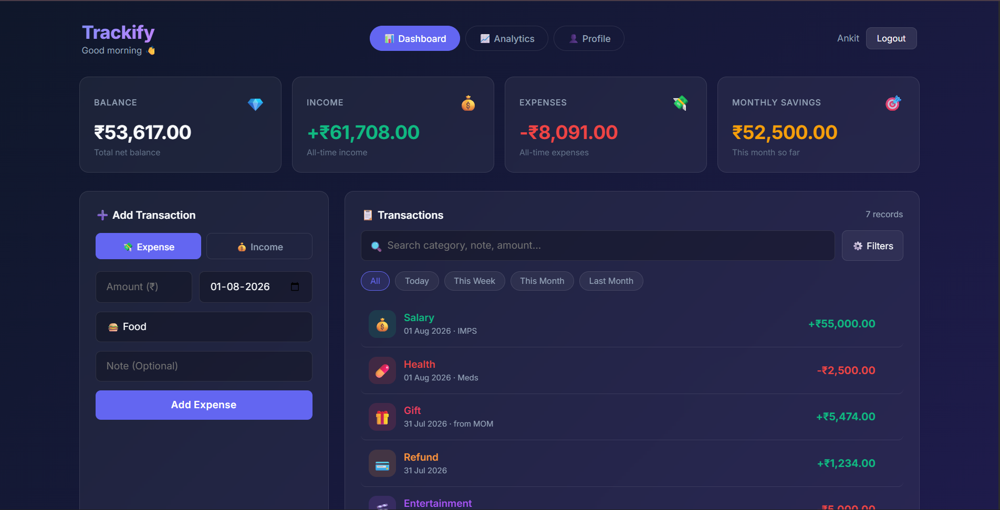

# 💸 Trackify — Full-Stack Expense Tracker

> A premium, full-stack personal finance tracker with real-time analytics, smart insights, and secure Firebase authentication.

**🔗 Live Demo:** [https://expense-tracker-xi-livid.vercel.app/](https://expense-tracker-xi-livid.vercel.app/)

---

## 📸 Preview



---

## ✨ Features

### 🔐 Authentication
- Google Sign-In (One-click OAuth)
- Email & Password login / signup
- Secure Firebase token verification on every API request
- Auto-redirect to dashboard on session restore

### 📊 Dashboard
- Real-time **Balance**, **Total Income**, **Total Expense**, and **Monthly Savings** cards
- Add **income** or **expense** transactions with category, date, and optional note
- **Edit**, **Delete**, and **Duplicate** any transaction
- Smart **search** across category, note, and amount
- **Date filters**: Today · This Week · This Month · Last Month
- Advanced filters: by **type**, **category**, **sort order**, and **custom date range**
- Skeleton loaders while data fetches

### 📈 Analytics
- **Monthly Income vs Expense** bar chart (full year view)
- **Category breakdown** doughnut chart for the selected month
- **Daily spending trend** line chart
- Month-over-month **% change badges** on summary cards
- Top spending category highlight
- Month & year selector to explore historical data

### 💡 Financial Insights
- Highest spending category
- Biggest income source
- Average daily spend
- Monthly savings rate
- Spending trend vs last month
- Food budget alert (if spending spikes >20%)

### 👤 Profile
- Profile card with avatar, name, email, join date
- Lifetime financial stats (total income, expense, balance, transaction count)
- Current month savings
- **Export to CSV** — expenses, income, or all transactions, with optional date range

---

## 🛠️ Tech Stack

| Layer | Technology |
|---|---|
| Frontend | Vanilla JS (ES6 Modules), HTML5, CSS3 |
| UI Style | Dark theme, Glassmorphism, micro-animations |
| Charts | Chart.js |
| Backend | Node.js, Express.js |
| Database | MongoDB Atlas (Mongoose ORM) |
| Auth (Client) | Firebase Web SDK v10 |
| Auth (Server) | Firebase Admin SDK |
| Deployment | Vercel (frontend) · Render (backend) |

---

## 📁 Project Structure

```
Expense_Tracker/
├── backend/
│   ├── config/
│   │   └── db.js                  # MongoDB connection
│   ├── controllers/
│   │   ├── analyticsController.js # Charts, summary, insights
│   │   ├── expenseController.js
│   │   ├── exportController.js    # CSV export
│   │   ├── incomeController.js
│   │   └── userController.js      # Profile & user sync
│   ├── middleware/
│   │   └── authMiddleware.js      # Firebase token verification
│   ├── models/
│   │   ├── Expense.js
│   │   ├── Income.js
│   │   └── User.js
│   ├── routes/
│   │   ├── analyticsRoutes.js
│   │   ├── expenseRoutes.js
│   │   ├── exportRoutes.js
│   │   ├── incomeRoutes.js
│   │   └── userRoutes.js
│   ├── serviceAccountKey.json     # Firebase Admin credentials (gitignored)
│   ├── app.js                     # Express app + middleware setup
│   └── server.js                  # Entry point
├── client/
│   ├── css/
│   ├── js/
│   │   ├── analytics.js           # Analytics tab logic + charts
│   │   ├── app.js                 # Dashboard logic
│   │   ├── auth.js                # Login/signup flows
│   │   ├── categories.js          # Category definitions
│   │   ├── firebase-init.js       # Firebase config
│   │   ├── profile.js             # Profile tab logic + CSV export
│   │   └── utils.js               # authFetch, formatCurrency, toasts
│   ├── pages/
│   │   └── dashboard.html
│   └── index.html                 # Auth page
├── .env                           # Environment variables (gitignored)
├── .gitignore
├── package.json
└── README.md
```

---

## 🚀 Getting Started (Local Development)

### Prerequisites
- Node.js v18+
- A [MongoDB Atlas](https://www.mongodb.com/atlas) cluster
- A [Firebase](https://console.firebase.google.com/) project with **Authentication** enabled

### 1. Clone the repository
```bash
git clone https://github.com/ankitkrshr/Expense_Tracker.git
cd Expense_Tracker
```

### 2. Install backend dependencies
```bash
npm install
```

### 3. Set up environment variables
Create a `.env` file in the root:
```env
PORT=5000
MONGO_URI=your_mongodb_atlas_connection_string
```

### 4. Firebase setup

**Backend (Admin SDK):**
1. Go to Firebase Console → Project Settings → Service Accounts
2. Click **Generate new private key** — download the JSON
3. Rename it `serviceAccountKey.json` and place it in the `backend/` folder

**Frontend (Web SDK):**
1. Go to Firebase Console → Project Settings → Your Apps → Web App
2. Copy your Firebase config object and paste it into `client/js/firebase-init.js`

### 5. Run locally

```bash
# Start the backend (from project root)
npm run dev
```

Then serve the frontend using VS Code Live Server or:
```bash
npx serve client
```

Open `http://localhost:3000` in your browser.

---

## 🌐 Deployment

### Backend → [Render](https://render.com)
1. Push to GitHub
2. Create a new **Web Service** on Render pointing to your repo
3. Set **Start Command** to `node backend/server.js`
4. Add environment variables: `MONGO_URI`, `PORT`
5. Upload your `serviceAccountKey.json` content via a `GOOGLE_APPLICATION_CREDENTIALS` secret or inline env var

### Frontend → [Vercel](https://vercel.com)
1. Import your GitHub repo on Vercel
2. Set the **Root Directory** to `client`
3. No build step needed — deploy as static site
4. Make sure `client/js/utils.js` points to your Render backend URL

---

## 🔌 API Reference

All endpoints require a Firebase Bearer token: `Authorization: Bearer <token>`

| Method | Endpoint | Description |
|--------|----------|-------------|
| `POST` | `/api/users/sync` | Sync Firebase user to MongoDB |
| `GET` | `/api/users/profile` | Get profile + lifetime stats |
| `GET` | `/api/incomes` | List all income transactions |
| `POST` | `/api/incomes` | Add an income |
| `PUT` | `/api/incomes/:id` | Update an income |
| `DELETE` | `/api/incomes/:id` | Delete an income |
| `GET` | `/api/expenses` | List all expense transactions |
| `POST` | `/api/expenses` | Add an expense |
| `PUT` | `/api/expenses/:id` | Update an expense |
| `DELETE` | `/api/expenses/:id` | Delete an expense |
| `GET` | `/api/analytics/summary` | Monthly summary + MoM change |
| `GET` | `/api/analytics/monthly` | Year-wide income vs expense |
| `GET` | `/api/analytics/categories` | Expense breakdown by category |
| `GET` | `/api/analytics/daily` | Daily spending for a month |
| `GET` | `/api/analytics/insights` | AI-style financial insights |
| `GET` | `/api/export/csv` | Export transactions as CSV |

---

## 📄 License

MIT — free to use, modify, and distribute.

---

*Built with ❤️ by [Ankit Kumar Shrivastava](https://github.com/ankitkrshr)*
